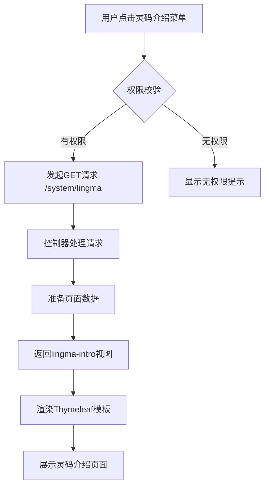
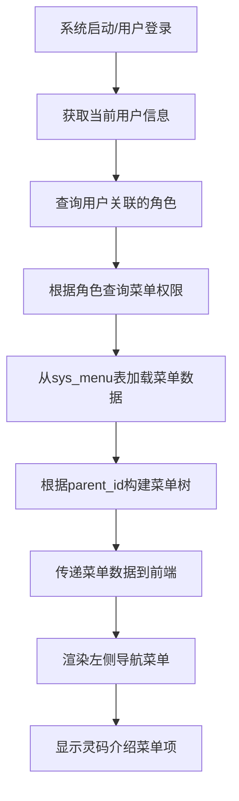
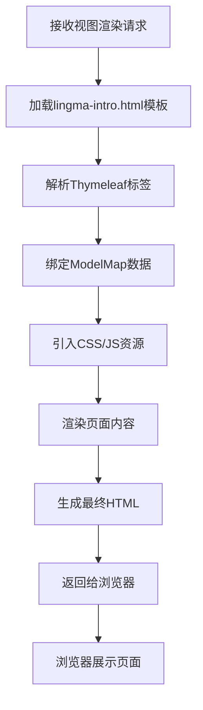

# 新增"灵码介绍"菜单设计文档

## 需求概述

在若依系统后台首页面的左侧菜单栏中新增一个视图菜单项，添加为二级菜单，名称为"灵码介绍"，类似"系统管理"等一级菜单的结构。点击该菜单后，在页面中展示阿里云通义灵码的相关介绍内容，展现形式和页面风格参考现有的 main.html 页面。

## 功能设计

### 菜单层级结构

采用与现有"系统管理"、"系统监控"相同的菜单模式：

| 层级 | 菜单名称 | 说明 |
|------|---------|------|
| 一级菜单 | 灵码介绍 | 顶层菜单入口 |
| 二级菜单 | 灵码介绍 | 实际内容展示页面 |

此设计保持与现有菜单结构的一致性，便于后续可能的菜单扩展。

### 菜单配置参数

#### 一级菜单配置

| 属性 | 值 | 说明 |
|------|-----|------|
| menu_id | 5 | 菜单唯一标识，紧随现有菜单编号 |
| menu_name | 灵码介绍 | 菜单显示名称 |
| parent_id | 0 | 父菜单ID，0表示顶级菜单 |
| order_num | 5 | 显示顺序，排在"若依官网"之后 |
| url | # | 占位符，一级菜单不需要实际URL |
| target | 空字符串 | 打开方式，默认页签模式 |
| menu_type | M | 菜单类型，M表示目录 |
| visible | 0 | 菜单状态，0表示显示 |
| is_refresh | 1 | 是否刷新，1表示不刷新 |
| perms | 空字符串 | 权限标识，一级目录无需权限标识 |
| icon | fa fa-lightbulb-o | 菜单图标，使用灯泡图标象征灵感与创新 |
| remark | 灵码介绍目录 | 备注信息 |

#### 二级菜单配置

| 属性 | 值 | 说明 |
|------|-----|------|
| menu_id | 117 | 菜单唯一标识，延续系统工具菜单后的编号规则 |
| menu_name | 灵码介绍 | 菜单显示名称 |
| parent_id | 5 | 父菜单ID，指向一级菜单 |
| order_num | 1 | 显示顺序，作为一级菜单下的第一项 |
| url | /system/lingma | 请求地址，访问路径 |
| target | 空字符串 | 打开方式，默认页签模式 |
| menu_type | C | 菜单类型，C表示菜单 |
| visible | 0 | 菜单状态，0表示显示 |
| is_refresh | 1 | 是否刷新，1表示不刷新（与main.html保持一致） |
| perms | system:lingma:view | 权限标识，用于权限控制 |
| icon | fa fa-code | 菜单图标，使用代码图标 |
| remark | 灵码介绍菜单 | 备注信息 |

### 页面内容设计

#### 页面布局结构

参考 main.html 的三栏式布局，页面结构如下：

```
┌─────────────────────────────────────────────────┐
│        顶部横幅区域（Header Section）              │
│  - 左侧：产品Logo/欢迎信息                         │
│  - 中间：核心产品介绍                             │
│  - 右侧：技术亮点/特性列表                         │
└─────────────────────────────────────────────────┘
┌─────────────────────────────────────────────────┐
│           主要内容区域（Content Section）           │
│  ┌────────────┐  ┌────────────┐  ┌────────────┐│
│  │联系信息模块  │  │产品特性模块  │  │使用指南模块  ││
│  │- 官网链接   │  │- AI能力特点 │  │- 快速上手   ││
│  │- 文档链接   │  │- 使用场景   │  │- 最佳实践   ││
│  │- 社区链接   │  │- 核心优势   │  │- 常见问题   ││
│  └────────────┘  └────────────┘  └────────────┘│
└─────────────────────────────────────────────────┘
```

#### 内容模块规划

**顶部横幅区域**

- 左侧栏：产品欢迎信息，包含阿里云通义灵码Logo或欢迎语，可添加二维码供移动端访问
- 中间栏：核心产品介绍
  - 产品名称：阿里云通义灵码
  - 产品定位：AI编程助手简介
  - 核心价值：提升开发效率、代码质量保障等
  - 版本信息：当前集成版本
- 右侧栏：技术亮点列表
  - 智能代码补全
  - 代码生成能力
  - 代码解释与优化
  - 技术栈支持范围

**主要内容区域**

左侧模块 - 联系信息
- 官方网站链接
- 产品文档链接
- 开发者社区链接
- 技术支持渠道

中间模块 - 产品特性
- AI能力介绍
  - 智能补全
  - 代码生成
  - 单元测试生成
  - 代码注释生成
  - 代码解释
- 适用场景
  - 日常开发
  - 代码重构
  - 技术学习
  - 问题排查

右侧模块 - 使用指南
- 快速开始步骤
- 常用功能说明
- 最佳实践建议
- 常见问题解答

#### 内容文案要点

- 产品定位：面向开发者的AI智能编程助手
- 核心优势：
  - 基于通义大模型的强大AI能力
  - 支持多种主流编程语言
  - 深度理解代码上下文
  - 提升开发效率数倍
- 主要功能：
  - 智能代码补全与生成
  - 自动生成单元测试
  - 代码解释与优化建议
  - 技术问题解答
- 适用人群：
  - 企业开发者
  - 独立开发者
  - 技术学习者

#### 视觉风格规范

延续若依系统现有的视觉风格：

- 色彩方案：
  - 主色调：与系统主题一致的蓝灰色系
  - 强调色：用于链接和按钮的蓝色
  - 背景色：浅灰色背景（gray-bg）配合白色内容区域
- 字体规范：
  - 标题字体：较大字号，加粗显示
  - 正文字体：标准字号，行高适中便于阅读
  - 代码字体：等宽字体
- 间距与布局：
  - 采用Bootstrap栅格系统
  - 保持模块间距一致
  - 使用ibox组件风格的卡片式布局

### 技术实现方案

#### 后端控制器设计

**控制器职责**

在 SysIndexController 中新增方法处理灵码介绍页面请求

**方法定义**

| 项目 | 说明 |
|------|------|
| 方法名 | lingmaIntro |
| 访问路径 | /system/lingma |
| HTTP方法 | GET |
| 返回类型 | String（视图名称） |
| 参数 | ModelMap mmap（用于传递数据到视图） |
| 权限注解 | @RequiresPermissions("system:lingma:view") |

**数据准备**

向视图传递的数据项：

| 数据项 | 类型 | 说明 |
|--------|------|------|
| version | String | 当前灵码版本信息 |
| officialUrl | String | 灵码官方网站URL |
| docUrl | String | 灵码文档中心URL |
| 其他配置 | String/Boolean | 根据实际需要的配置参数 |

#### 前端视图设计

**视图文件**

| 项目 | 说明 |
|------|------|
| 文件路径 | templates/system/lingma-intro.html |
| 模板引擎 | Thymeleaf |
| 父模板 | 无，独立页面 |
| 依赖资源 | Bootstrap、Font Awesome、若依自定义样式 |

**页面结构**

采用与 main.html 相同的结构模式：
- HTML5文档类型
- Thymeleaf命名空间声明
- 响应式viewport设置
- 引入系统标准CSS资源
- 使用Bootstrap栅格系统布局
- 应用gray-bg背景样式

**样式复用**

复用若依系统现有样式类：
- bootstrap.min.css：基础布局和组件样式
- font-awesome.min.css：图标字体
- style.min.css：系统自定义样式
- 卡片容器：ibox、ibox-title、ibox-content
- 间距工具类：float-e-margins、no-padding等

#### 权限控制设计

**权限标识**

| 权限项 | 权限标识 | 说明 |
|--------|---------|------|
| 页面访问 | system:lingma:view | 控制灵码介绍页面的访问权限 |

**权限配置流程**

1. 在 sys_menu 表中配置权限标识
2. 在 sys_role_menu 表中为相应角色分配菜单权限
3. 控制器方法使用 @RequiresPermissions 注解进行权限校验
4. 前端通过 Shiro 标签控制菜单显示

#### 数据持久化方案

**数据库变更**

在 sys_menu 表中插入新菜单记录，SQL语句设计：

```
一级菜单插入语句：
INSERT INTO sys_menu VALUES(
  '5',                        -- menu_id
  '灵码介绍',                  -- menu_name
  '0',                        -- parent_id
  '5',                        -- order_num
  '#',                        -- url
  '',                         -- target
  'M',                        -- menu_type
  '0',                        -- visible
  '1',                        -- is_refresh
  '',                         -- perms
  'fa fa-lightbulb-o',        -- icon
  'admin',                    -- create_by
  sysdate(),                  -- create_time
  '',                         -- update_by
  null,                       -- update_time
  '灵码介绍目录'                -- remark
);

二级菜单插入语句：
INSERT INTO sys_menu VALUES(
  '117',                      -- menu_id
  '灵码介绍',                  -- menu_name
  '5',                        -- parent_id
  '1',                        -- order_num
  '/system/lingma',           -- url
  '',                         -- target
  'C',                        -- menu_type
  '0',                        -- visible
  '1',                        -- is_refresh
  'system:lingma:view',       -- perms
  'fa fa-code',               -- icon
  'admin',                    -- create_by
  sysdate(),                  -- create_time
  '',                         -- update_by
  null,                       -- update_time
  '灵码介绍菜单'                -- remark
);
```

**权限分配**

为超级管理员角色（role_id=1）默认分配此菜单权限：

```
INSERT INTO sys_role_menu VALUES ('1', '5');   -- 一级菜单权限
INSERT INTO sys_role_menu VALUES ('1', '117'); -- 二级菜单权限
```

## 系统交互流程

### 用户访问流程



### 菜单加载流程



### 页面渲染流程



## 兼容性考虑

### 浏览器兼容性

- 目标浏览器：Chrome、Firefox、Edge、Safari最新版本
- IE浏览器：支持IE11及以上版本（系统已有IE版本检测提示页面）
- 移动端：支持移动设备访问（Bootstrap响应式布局）

### 菜单样式兼容性

- 左侧菜单模式：完全支持，与现有菜单结构一致
- 横向菜单模式：需要在index-topnav.html中同步添加菜单项配置
- 菜单折叠/展开：遵循现有菜单交互逻辑

### 主题兼容性

- 支持系统所有皮肤主题（通过CSS变量和类名控制）
- 保持与系统整体风格的一致性
- 深色/浅色主题自动适配

## 扩展性设计

### 内容扩展性

- 模块化设计：各内容模块相对独立，便于内容更新
- 可配置性：关键信息（如链接、版本号）通过后端配置传递
- 国际化支持：预留多语言切换接口（虽然当前仅支持中文）

### 功能扩展性

未来可能的扩展方向：

1. 交互式教程：添加灵码使用的交互式引导教程
2. 视频教程嵌入：集成视频播放功能展示使用演示
3. 在线试用：集成在线代码编辑器体验灵码功能
4. 用户反馈：添加反馈表单收集用户意见
5. 版本更新日志：展示灵码各版本的更新内容

### 菜单结构扩展

为未来可能的子菜单扩展预留空间：

| 潜在子菜单 | 说明 |
|-----------|------|
| 功能介绍 | 详细的功能列表和说明 |
| 使用教程 | 分步骤的使用指南 |
| 最佳实践 | 实际应用场景案例 |
| 常见问题 | FAQ集合 |

## 测试验证要点

### 功能测试

| 测试项 | 验证内容 |
|-------|---------|
| 菜单显示 | 左侧菜单栏正确显示"灵码介绍"一级和二级菜单 |
| 菜单点击 | 点击二级菜单能正确跳转到介绍页面 |
| 页面渲染 | 页面内容正确显示，布局符合设计 |
| 样式一致性 | 页面风格与main.html保持一致 |
| 链接有效性 | 所有外部链接能正确访问 |

### 权限测试

| 测试项 | 验证内容 |
|-------|---------|
| 权限控制 | 无权限用户看不到菜单项 |
| 直接访问 | 无权限用户直接访问URL被拦截 |
| 角色分配 | 为角色分配权限后能正常访问 |
| 权限撤销 | 撤销权限后菜单隐藏且无法访问 |

### 兼容性测试

| 测试项 | 验证内容 |
|-------|---------|
| 浏览器兼容 | 在Chrome、Firefox、Edge中显示正常 |
| 响应式布局 | 在不同屏幕尺寸下布局合理 |
| 菜单模式 | 左侧菜单和横向菜单模式均正常 |
| 主题切换 | 切换系统主题后样式正常 |

### 性能测试

| 测试项 | 验证内容 |
|-------|---------|
| 页面加载 | 页面加载时间在可接受范围内 |
| 资源优化 | CSS/JS等资源合理压缩和缓存 |
| 数据库查询 | 菜单加载不影响系统整体性能 |

## 实施优先级

### 核心功能（必须完成）

1. 数据库菜单数据插入
2. 后端控制器方法实现
3. 前端视图页面开发
4. 基础权限控制配置

### 标准功能（建议完成）

1. 页面内容充实和美化
2. 外部链接配置
3. 横向菜单模式适配
4. 响应式布局优化

### 增强功能（可选完成）

1. 交互式元素添加
2. 多语言支持预留
3. 内容配置化管理
4. 用户反馈功能

## 风险与应对

### 潜在风险

| 风险项 | 影响 | 应对策略 |
|-------|------|---------|
| 菜单ID冲突 | 数据库插入失败 | 检查现有最大ID，选择合适的新ID |
| 权限配置错误 | 用户无法访问或越权访问 | 严格按照权限配置流程，充分测试 |
| 样式不一致 | 影响用户体验 | 严格复用系统现有样式类 |
| 内容更新不及时 | 信息过时 | 设计配置化方案便于内容更新 |

### 数据一致性保障

- 使用事务确保菜单数据和权限数据插入的原子性
- 插入前检查ID是否已存在，避免冲突
- 数据库脚本提供回滚方案

## 验收标准

### 基本验收标准

1. 系统左侧菜单栏出现"灵码介绍"菜单项
2. 点击菜单能正确跳转到灵码介绍页面
3. 页面内容完整，布局合理，样式美观
4. 页面风格与main.html保持一致
5. 权限控制正常，无权限用户无法访问

### 质量验收标准

1. 代码符合若依系统编码规范
2. 页面通过浏览器兼容性测试
3. 性能测试无明显性能问题
4. 无明显的bug和异常
5. 所有链接可正常访问

## 维护建议

### 内容维护

- 定期更新产品版本信息
- 及时更新功能特性描述
- 保持外部链接的有效性
- 根据用户反馈优化内容

### 技术维护

- 随系统升级同步更新相关依赖
- 保持与系统主题和样式的一致性
- 定期检查权限配置的正确性
- 监控页面访问日志和异常- 定期检查权限配置的正确性
