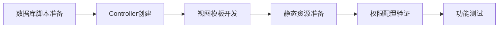

# 系统后台新增"灵码介绍"二级菜单设计文档

## 1. 需求概述

在若依后台管理系统的左侧菜单栏中，新增一个独立的一级菜单模块"灵码介绍"，该菜单下包含一个二级菜单页面，用于展示阿里云通义灵码的相关介绍内容。页面展现形式和风格参考现有的 `main.html`（若依介绍页面）。

### 1.1 业务价值

- 为系统用户提供通义灵码产品的介绍入口
- 丰富系统功能模块，增强产品生态体系展示
- 延续系统现有UI风格，保持用户体验一致性

### 1.2 功能定位

这是一个纯展示类页面，不涉及数据库CRUD操作，主要用于内容呈现和产品宣传。

## 2. 系统架构分析

### 2.1 菜单体系结构

若依系统采用三级菜单架构：

| 层级 | 类型标识 | 说明 | 示例 |
|------|---------|------|------|
| 一级菜单 | M（目录） | 顶层导航分类 | 系统管理、系统监控 |
| 二级菜单 | C（菜单）或 M（子目录） | 具体功能入口或子分类 | 用户管理、角色管理 |
| 三级菜单 | C（菜单） | 二级目录下的功能页面 | 操作日志、登录日志 |

### 2.2 菜单存储结构

菜单数据存储在 `sys_menu` 表中，采用树形结构设计：

| 字段 | 用途 | 本次设计关注点 |
|------|------|---------------|
| menu_id | 菜单唯一标识 | 需选择未使用的ID |
| menu_name | 菜单显示名称 | "灵码介绍" |
| parent_id | 父菜单ID | 一级菜单为0，二级菜单指向一级菜单ID |
| order_num | 显示顺序 | 决定菜单在同级中的排列位置 |
| url | 访问路径 | 一级菜单为#，二级菜单为实际页面路径 |
| menu_type | 菜单类型 | M=目录，C=菜单，F=按钮 |
| icon | 菜单图标 | 使用 FontAwesome 图标类名 |
| perms | 权限标识 | 用于权限控制，格式为模块:功能:操作 |

### 2.3 权限控制机制

菜单可见性由以下因素决定：
- `visible` 字段：0=显示，1=隐藏
- 角色菜单关联表 `sys_role_menu`：控制不同角色可访问的菜单范围
- `perms` 权限标识：配合Shiro进行细粒度权限控制

## 3. 设计方案

### 3.1 菜单层级结构设计

基于需求"添加为二级菜单"的表述，提供两种理解方案：

#### 方案A：一级目录 + 二级菜单（推荐）

```
灵码介绍（一级目录，menu_type=M）
  └── 灵码介绍（二级菜单，menu_type=C，实际页面）
```

**特点**：
- 符合"类似系统管理"的结构特征
- 可扩展性强，未来可添加更多子菜单
- 左侧菜单栏呈现折叠/展开效果

#### 方案B：直接二级菜单

```
灵码介绍（直接作为某个现有一级菜单下的二级菜单）
```

**特点**：
- 结构简单，仅一个菜单项
- 需明确归属于哪个一级菜单

**推荐使用方案A**，原因：
1. 符合"类似系统管理"的描述
2. 为后续扩展预留空间
3. 在左侧菜单栏中具有独立性

### 3.2 菜单数据模型设计

#### 3.2.1 一级菜单（灵码介绍目录）

| 属性 | 值 | 说明 |
|------|-----|------|
| menu_id | 5 | 紧随现有最大一级菜单ID（1-4） |
| menu_name | 灵码介绍 | 菜单显示名称 |
| parent_id | 0 | 一级菜单的父ID为0 |
| order_num | 5 | 排序在"若依官网"之后 |
| url | # | 目录类型使用占位符 |
| target | 空字符串 | 默认页签打开方式 |
| menu_type | M | 目录类型 |
| visible | 0 | 显示状态 |
| is_refresh | 1 | 不刷新 |
| perms | 空字符串 | 目录无需权限标识 |
| icon | fa fa-lightbulb-o | 使用灯泡图标，象征创新与智能 |
| remark | 灵码介绍目录 | 备注信息 |

#### 3.2.2 二级菜单（灵码介绍页面）

| 属性 | 值 | 说明 |
|------|-----|------|
| menu_id | 117 | 紧随现有最大二级菜单ID（116） |
| menu_name | 灵码介绍 | 菜单显示名称 |
| parent_id | 5 | 指向一级菜单"灵码介绍" |
| order_num | 1 | 该目录下第一个菜单 |
| url | /introduction/lingma | 访问路径 |
| target | 空字符串 | 默认页签打开方式 |
| menu_type | C | 菜单类型 |
| visible | 0 | 显示状态 |
| is_refresh | 1 | 不刷新 |
| perms | introduction:lingma:view | 权限标识 |
| icon | fa fa-robot | 使用机器人图标 |
| remark | 灵码介绍菜单 | 备注信息 |

### 3.3 页面内容设计

参考 `main.html` 的布局结构，设计内容分为以下区块：

#### 3.3.1 整体布局

采用响应式栅格布局（Bootstrap Grid System）：

```
+--------------------------------------------------+
|  页面标题区（dashboard-header）                    |
|  +---------------------+------------------------+ |
|  | 左侧区域（col-sm-3） | 中间区域（col-sm-5）     | |
|  | - 问候语             | - 产品简介              | |
|  | - 二维码             | - 版本信息              | |
|  |                     | - 特色标签              | |
|  |                     | - 快捷链接              | |
|  +---------------------+------------------------+ |
|  | 右侧区域（col-sm-4）                            | |
|  | - 技术特性列表                                  | |
|  +------------------------------------------------+ |
+--------------------------------------------------+
|  内容区域（wrapper-content）                       |
|  +---------------------+------------------------+ |
|  | 卡片1（col-sm-4）    | 卡片2（col-sm-4）       | |
|  +---------------------+------------------------+ |
|  | 卡片3（col-sm-4）                              | |
|  +------------------------------------------------+ |
+--------------------------------------------------+
```

#### 3.3.2 内容区块定义

| 区块名称 | 内容规划 | 样式参考 |
|---------|---------|---------|
| 问候语与二维码 | 展示访问提示、灵码相关二维码 | main.html 左侧列 |
| 产品核心介绍 | 标题、产品定位、核心能力描述、版本标签 | main.html 中间列 |
| 技术特性列表 | 核心功能点的有序列表展示 | main.html 右侧列 |
| 卡片区域1 | 产品优势或功能特点 | main.html ibox组件 |
| 卡片区域2 | 应用场景或版本更新 | main.html ibox组件 |
| 卡片区域3 | 资源链接或帮助信息 | main.html ibox组件 |

#### 3.3.3 具体内容要点

**产品简介区域**：
- 阿里云通义灵码的定位与价值
- 核心能力：智能补全、代码生成、问答对话、单测生成等
- 适用场景：开发效率提升、代码质量改进

**技术特性列表**：
- 多语言支持能力
- AI模型技术
- IDE集成方式
- 企业级安全特性

**卡片内容建议**：
- 卡片1：产品亮点与创新点
- 卡片2：适用开发场景
- 卡片3：官方资源链接（文档、社区、GitHub等）

### 3.4 前端路由与Controller设计

#### 3.4.1 URL路由规划

| 资源 | 路径 | 控制器方法 | 说明 |
|------|------|-----------|------|
| 页面视图 | /introduction/lingma | getLingmaPage() | 返回Thymeleaf模板 |

#### 3.4.2 Controller职责

创建新的控制器类 `LingmaController`：

**职责**：
- 处理灵码介绍页面的访问请求
- 向视图传递必要的展示数据（如版本号等）
- 应用 `@RequiresPermissions` 注解进行权限控制

**方法签名**：
- 方法名：`lingma()`
- 返回值：字符串类型，指向Thymeleaf模板路径
- 参数：ModelMap（用于传递数据到视图层）

#### 3.4.3 权限控制

- 使用Shiro的 `@RequiresPermissions("introduction:lingma:view")` 注解
- 确保只有具备相应权限的用户可访问

### 3.5 视图模板设计

#### 3.5.1 模板文件位置

```
ruoyi-admin/src/main/resources/templates/introduction/lingma.html
```

#### 3.5.2 模板技术栈

- 模板引擎：Thymeleaf
- UI框架：Bootstrap 3.x
- 图标库：FontAwesome
- 样式主题：H+（RuoYi内置）

#### 3.5.3 关键HTML结构元素

| 元素 | CSS类 | 用途 |
|------|-------|------|
| 外层容器 | gray-bg | 灰色背景 |
| 顶部区域 | border-bottom white-bg dashboard-header | 标题头部 |
| 内容区域 | wrapper wrapper-content | 主内容包裹 |
| 卡片组件 | ibox float-e-margins | 浮动卡片 |
| 卡片标题 | ibox-title | 卡片头部 |
| 卡片内容 | ibox-content | 卡片主体 |

#### 3.5.4 静态资源引用

- CSS：bootstrap.min.css、font-awesome.min.css、style.min.css
- 使用Thymeleaf的 `th:href="@{/css/...}"` 语法引用
- 图片资源需放置在 `static/img/` 目录下

### 3.6 数据库变更设计

#### 3.6.1 菜单数据插入

需要在 `sys_menu` 表中插入两条记录：

**SQL语句模板**（一级菜单）：

```
参数说明：
- menu_id: 5
- menu_name: '灵码介绍'
- parent_id: 0
- order_num: 5
- url: '#'
- menu_type: 'M'
- visible: '0'
- is_refresh: '1'
- icon: 'fa fa-lightbulb-o'
- 其余字段使用默认值
```

**SQL语句模板**（二级菜单）：

```
参数说明：
- menu_id: 117
- menu_name: '灵码介绍'
- parent_id: 5
- order_num: 1
- url: '/introduction/lingma'
- menu_type: 'C'
- visible: '0'
- is_refresh: '1'
- perms: 'introduction:lingma:view'
- icon: 'fa fa-robot'
- 其余字段使用默认值
```

#### 3.6.2 角色权限关联

若需要让普通角色也能访问，需在 `sys_role_menu` 表插入关联记录：

| 角色ID | 菜单ID | 说明 |
|-------|--------|------|
| 2 | 5 | 普通角色关联一级菜单 |
| 2 | 117 | 普通角色关联二级菜单 |

超级管理员（role_id=1）默认拥有所有菜单权限，无需额外配置。

### 3.7 图标选型建议

基于FontAwesome图标库，推荐以下方案：

| 层级 | 推荐图标类名 | 视觉含义 | 备选方案 |
|------|-------------|---------|---------|
| 一级菜单 | fa fa-lightbulb-o | 创新、智慧 | fa fa-magic（魔法棒）、fa fa-star-o（星星） |
| 二级菜单 | fa fa-robot | AI助手 | fa fa-code（代码）、fa fa-keyboard-o（键盘） |

## 4. 实现流程规划

### 4.1 开发顺序



### 4.2 各阶段产出物

| 阶段 | 产出物 | 验收标准 |
|------|--------|---------|
| 数据库脚本 | SQL文件 | 菜单数据正确插入，ID无冲突 |
| Controller开发 | Java类文件 | 编译通过，路由映射正确 |
| 视图模板 | HTML文件 | 页面元素完整，样式符合要求 |
| 静态资源 | 图片文件 | 二维码等图片准备就绪 |
| 权限配置 | 角色菜单关联数据 | 不同角色访问权限验证通过 |
| 功能测试 | 测试报告 | 菜单显示正常，页面可访问 |

## 5. 技术约束与规范

### 5.1 后端开发规范

| 规范项 | 要求 |
|--------|------|
| 包路径 | com.ruoyi.web.controller.introduction |
| 类命名 | LingmaController |
| 权限注解 | @RequiresPermissions("introduction:lingma:view") |
| 请求映射 | @GetMapping("/introduction/lingma") |
| 日志记录 | 使用SLF4J，记录关键访问信息 |

### 5.2 前端开发规范

| 规范项 | 要求 |
|--------|------|
| 模板路径 | templates/introduction/lingma.html |
| 命名空间 | xmlns:th="http://www.thymeleaf.org" |
| 样式继承 | 复用H+主题样式，不自定义CSS |
| 响应式设计 | 使用Bootstrap栅格系统，适配移动端 |
| 字符编码 | UTF-8 |

### 5.3 数据库规范

| 规范项 | 要求 |
|--------|------|
| ID分配 | 不使用已被占用的menu_id |
| 命名规则 | 权限标识使用小写英文，以冒号分隔 |
| 时间函数 | 使用 sysdate() 记录创建时间 |
| 字符转义 | URL中特殊字符需转义 |

## 6. 扩展性考虑

### 6.1 未来扩展方向

| 扩展点 | 描述 |
|--------|------|
| 子菜单扩展 | 在"灵码介绍"目录下可继续添加更多子菜单 |
| 多语言支持 | 页面内容可接入国际化资源文件 |
| 动态内容 | 从后端接口获取版本信息、更新日志等数据 |
| 用户反馈 | 添加意见收集表单或问卷调查模块 |

### 6.2 接口预留建议

虽然当前为纯展示页面，但可预留以下扩展点：

| 接口类型 | 用途 | 示例路径 |
|---------|------|---------|
| 版本信息查询 | 获取最新版本号 | /api/lingma/version |
| 文档资源列表 | 动态加载文档链接 | /api/lingma/docs |
| 统计埋点 | 记录页面访问次数 | /api/lingma/statistics |

## 7. 风险与注意事项

### 7.1 技术风险

| 风险点 | 影响 | 应对措施 |
|--------|------|---------|
| 菜单ID冲突 | 数据库插入失败 | 执行前检查 sys_menu 表最大ID |
| 权限配置遗漏 | 普通用户无法访问 | 完成后多角色登录测试 |
| 路由映射错误 | 404页面错误 | 确保Controller路径与菜单URL一致 |
| 样式不一致 | 用户体验下降 | 严格参照 main.html 样式 |

### 7.2 内容准备注意事项

| 项目 | 要求 |
|------|------|
| 灵码介绍文案 | 需由产品或运营提供官方描述 |
| 二维码图片 | 需准备清晰的二维码图片资源 |
| 版本信息 | 确认当前展示的版本号 |
| 外部链接 | 验证官网、文档等链接有效性 |

### 7.3 兼容性考虑

| 维度 | 要求 |
|------|------|
| 浏览器 | 支持Chrome、Firefox、Edge、Safari最新版本 |
| IE兼容 | IE 11及以上（若系统需支持） |
| 移动端 | 通过Bootstrap响应式适配手机/平板 |
| 分辨率 | 最小支持1366x768分辨率 |

## 8. 验收标准

### 8.1 功能性验收

| 验收项 | 标准 |
|--------|------|
| 菜单显示 | 左侧菜单栏正确显示"灵码介绍"一级菜单及其子菜单 |
| 点击响应 | 点击菜单后正确打开页签，加载灵码介绍页面 |
| 页面完整性 | 页面所有区块内容正常显示，无空白或错位 |
| 权限控制 | 无权限用户访问时正确拦截并提示 |

### 8.2 非功能性验收

| 验收项 | 标准 |
|--------|------|
| 页面加载速度 | 首屏加载时间 < 2秒 |
| 样式一致性 | 与系统其他页面风格统一，无明显差异 |
| 响应式表现 | 移动端浏览无横向滚动条，内容可读性好 |
| 无障碍访问 | 图片有alt属性，链接有语义化文本 |

### 8.3 测试用例建议

| 用例编号 | 测试场景 | 预期结果 |
|---------|---------|---------|
| TC-001 | 超级管理员登录后查看左侧菜单 | 显示"灵码介绍"菜单 |
| TC-002 | 点击"灵码介绍"一级菜单 | 展开显示二级菜单项 |
| TC-003 | 点击二级菜单"灵码介绍" | 在页签中打开页面，内容完整显示 |
| TC-004 | 普通角色登录（已授权） | 能够访问灵码介绍页面 |
| TC-005 | 未授权角色访问 | 系统拦截并提示无权限 |
| TC-006 | 缩小浏览器窗口至手机尺寸 | 页面内容自适应调整，可正常浏览 |

## 9. 附录

### 9.1 参考文档

| 文档名称 | 位置 |
|---------|------|
| 若依官方文档 | http://doc.ruoyi.vip |
| Bootstrap文档 | https://v3.bootcss.com |
| FontAwesome图标库 | https://fontawesome.com/v4.7.0/icons/ |
| Thymeleaf文档 | https://www.thymeleaf.org/documentation.html |

### 9.2 相关文件清单

| 文件类型 | 文件路径 |
|---------|---------|
| 参考页面 | ruoyi-admin/src/main/resources/templates/main.html |
| 菜单数据库脚本 | sql/ry_20250416.sql |
| 样式文件 | ruoyi-admin/src/main/resources/static/css/ |
| 图片资源目录 | ruoyi-admin/src/main/resources/static/img/ |

### 9.3 术语表

| 术语 | 说明 |
|------|------|
| 灵码 | 阿里云通义灵码，AI智能编程助手 |
| 二级菜单 | 菜单体系中的第二层级，位于一级目录之下 |
| Shiro | Apache Shiro安全框架，用于认证与授权 |
| Thymeleaf | 服务端Java模板引擎 |
| H+ | 若依系统使用的后台管理UI主题 |
| RBAC | 基于角色的访问控制模型 |
